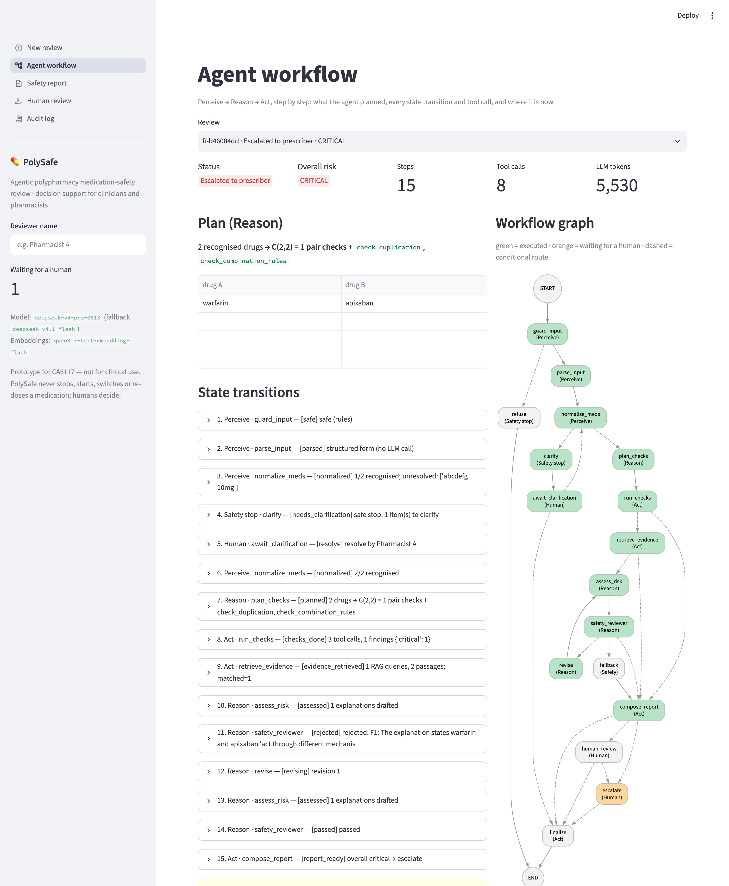
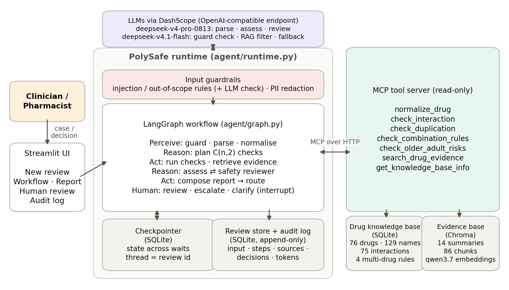
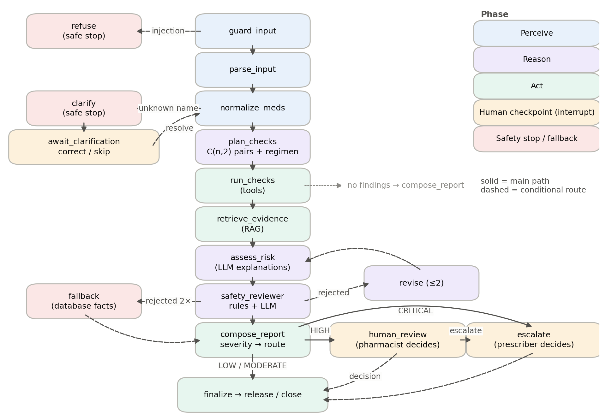
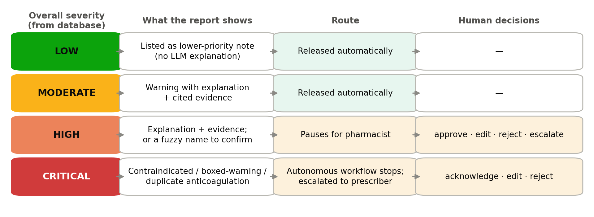
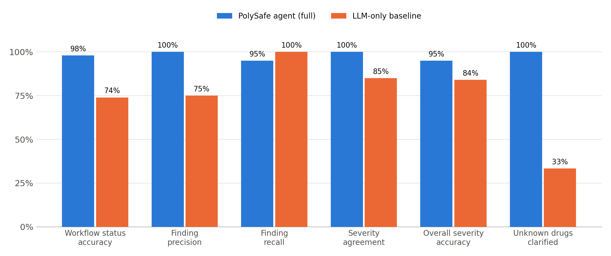

# PolySafe — an agentic AI assistant for polypharmacy medication-safety review

CA6117 AI in Healthcare · group project · **prototype for teaching — not for clinical use**

**Contents:** [What it does](#what-it-does) · [Quick start](#quick-start) · [Demo walkthrough](#demo-walkthrough) ·
[Architecture](#architecture) · [Safety and governance](#safety-and-governance) · [Evaluation](#evaluation) ·
[Command-line reference](#command-line-reference) · [Configuration](#configuration) ·
[Repository structure](#repository-structure) · [Troubleshooting](#troubleshooting) · [Limitations](#limitations)

---

## What it does

Patients on many medicines — mostly older adults with several chronic conditions — are exposed to drug–drug
interactions, duplicated therapy and dangerous multi-drug combinations. PolySafe prepares a **first-pass medication
safety review for a pharmacist or clinician**:

1. **Perceive** — reads a medication list or a free-text note and normalises messy drug names (brand names,
   misspellings, dose text); it never guesses a drug it cannot identify.
2. **Reason** — plans the checks the list needs: every drug pair (C(n,2)), duplication, multi-drug rules and, for
   patients aged 65+, potentially inappropriate medicines.
3. **Act** — runs the checks with **read-only tools** over a curated drug knowledge base and retrieves **verbatim
   evidence** for every finding.
4. **Explain and self-check** — an LLM explains each finding; a separate **safety reviewer** (rules + LLM) rejects
   unsupported claims, wrong citations and medication-change instructions.
5. **Escalate** — low/moderate risks are released, **high** risks wait for a pharmacist, **critical** risks stop the
   autonomous workflow and go to the prescriber. Reviews pause and resume across waits.
6. **Audit** — every input, step, tool call, source, output and signed human decision is logged.

Severity always comes from the knowledge base, never from the LLM. PolySafe never tells anyone to stop, start,
switch or re-dose a medicine — humans decide.

**Results on 43 test cases** (full agent vs. the same LLM without tools): workflow-status accuracy **98% vs 74%**,
finding precision **100% vs 75%**, severity agreement **100% vs 85%**, unknown drugs clarified **3/3 vs 1/3**,
evidence-grounded findings **37/37 vs 0**. Details in [Evaluation](#evaluation).

The written report (design rationale, governance, evaluation and limitations) is submitted separately as
`PolySafe_Report.pdf`.

---

## Quick start

Tested on macOS (Apple silicon) with Python 3.12; Linux works the same way. No GPU needed. About 10 minutes.

### 1. Environment

```bash
cd polysafe
conda env create -f environment.yml      # creates the "ca6117_polysafe" environment (Python 3.12, pinned versions)
conda activate ca6117_polysafe
```

Without Conda: `python3.12 -m venv .venv && source .venv/bin/activate && pip install -r requirements.txt`.

### 2. API key

All models are called through Alibaba Cloud Model Studio (**DashScope**) with its OpenAI-compatible endpoint, so one
key serves everything.

```bash
cp .env.example .env        # then edit .env
```

| Variable | Value |
|---|---|
| `DASHSCOPE_API_KEY` | your DashScope key (if a key was provided with the submission, use that one) |
| `DASHSCOPE_BASE_URL` | `https://dashscope.aliyuncs.com/compatible-mode/v1` (mainland account) or `https://dashscope-intl.aliyuncs.com/compatible-mode/v1` (international account) |

Models used (one line each in `configs/agent_config.yaml`): `deepseek-v4-pro-0813` (main agent),
`deepseek-v4.1-flash` (fallback and helper), `qwen3.7-text-embedding-flash` (evidence retrieval). Any chat model with
function calling can be substituted.

### 3. Build the knowledge bases (~1 minute)

```bash
python scripts/build_db.py         # data/*.csv  -> data/polysafe.db  (validates every reference)
python scripts/build_rag.py        # data/evidence/*.md -> data/chroma_db (embeds 86 passages)
```

Success: `build_db.py` prints the table sizes (`drugs 76 … interactions 75 … interactions by severity: low=2,
moderate=35, high=34, critical=4`); `build_rag.py` prints `14 documents, 86 new chunks` followed by four sample
queries, each answered from the matching evidence section.

### 4. Check that everything works (~1 minute)

```bash
python scripts/smoke_test.py       # drug DB, MCP tool server, both LLMs (tool calling + structured output), embeddings
pytest -q tests/                   # 86 tests (unit, safety rules, MCP integration, human-in-the-loop)
```

Success: `9/9 checks passed` and `86 passed`. The test files that call the LLM are skipped automatically when no API
key is set. The MCP tool server (`http://127.0.0.1:8775/mcp`) is started automatically in the background the first
time it is needed; its log is `outputs/logs/mcp_server.log`.

### 5. Start the web demo

```bash
streamlit run web/app_ui.py        # opens http://localhost:8501
```

The first page load takes a few seconds while the agent and the tool server start. Enter a **reviewer name** in the
sidebar before making decisions — every human decision is signed and logged.

---

## Demo walkthrough

On **New review**, pick a case from *Load a demo case* and press **Run medication review**. The workflow appears live,
step by step; a review takes about 5–15 s.

| Demo case | What happens | Then |
|---|---|---|
| 72y · warfarin + aspirin + ibuprofen + omeprazole + amlodipine | **CRITICAL** (anticoagulant + antiplatelet + NSAID), 2 high and 1 moderate interaction, 4 older-adult notes → **escalated to prescriber** | *Human review*: acknowledge with a comment |
| Free-text note · triple whammy + brand names | The LLM parses the note; Zestril / Lasix / Aldactone / Advil are resolved; **HIGH** (triple whammy, ACE inhibitor + spironolactone) → **waits for pharmacist** | approve, or edit and add a note |
| 67y · oxycodone + lorazepam + gabapentin | **CRITICAL** opioid + benzodiazepine (boxed warning) → escalated | acknowledge |
| 58y · metformin + atorvastatin + lisinopril + paracetamol | no findings → **released**, no LLM call | — |
| Unknown medication | `abcdefg 10mg` cannot be identified → **safe stop: clarification**, no LLM call | *Human review*: correct the name to `Eliquis 5mg` → the workflow re-runs and finds a **critical duplicate anticoagulation** |
| Prompt injection | "Ignore all previous instructions…" → **refused** | — |
| Asks the system which drug to stop | review performed **plus a scope notice** (PolySafe does not make medication decisions) | — |

Then look at:

- **Agent workflow** — the plan (C(n,2) pairs), every state transition with its tool calls, and the workflow graph
  (executed nodes green, waiting node orange).
- **Safety report** — findings by severity with explanation, recommendation, source and expandable verbatim evidence.
- **Human review** — try an invalid decision (no comment on *reject*): it is refused and the review stays paused.
- **Audit log** — filter by review, event or actor; export CSV.

To start the demo from an empty review history: stop Streamlit, `rm -rf data/runtime`, start it again (the runtime
store and checkpoints are recreated automatically).



---

## Architecture



| Layer | Implementation | Where |
|---|---|---|
| Workflow and state | LangGraph `StateGraph`, 19 nodes, `interrupt()` human checkpoints, `AsyncSqliteSaver` checkpointer (thread = review id) | `agent/graph.py`, `agent/runtime.py` |
| LLM calls | LangChain + function-calling structured output (Pydantic schemas); DeepSeek via DashScope; fallback model | `agent/schemas.py`, `agent/models/cloud_model.py`, `configs/prompts.yaml` |
| Tools | Model Context Protocol server (FastMCP, streamable HTTP), 7 read-only tools | `tools/` |
| Drug knowledge base | SQLite built from CSV, validated on build | `data/*.csv`, `db/drug_db.py`, `scripts/build_db.py` |
| Evidence retrieval | Chroma, heading-aware chunks, agentic RAG that selects verbatim passages | `rag/`, `data/evidence/` |
| Guardrails | injection / out-of-scope rules + LLM confirmation, PII redaction | `agent/guardrails.py` |
| Review store and audit log | SQLite, append-only audit events | `db/review_store.py` |
| UI | Streamlit, 5 pages, live workflow streaming | `web/app_ui.py` |

### Workflow



`guard_input → parse_input → normalize_meds → plan_checks → run_checks → retrieve_evidence → assess_risk ⇄
safety_reviewer → compose_report → finalize | human_review | escalate`, with the safe stops `refuse` (prompt
injection) and `clarify → await_clarification` (unknown drug), a bounded revision loop (≤ 2) and a database-facts
`fallback`. The exact graph exported from the code is in `docs/workflow_graph.mmd`.

### Tools (all read-only)

| Tool | What it does |
|---|---|
| `normalize_drug` | name as written → drug (exact / brand / alias / fuzzy); fuzzy matches need human confirmation; unknown names are never guessed |
| `check_interaction` | one drug pair → drug- and class-level interactions; highest severity from the database |
| `check_duplication` | whole list → same-class duplication (two NSAIDs, two anticoagulants…) or one drug entered twice |
| `check_combination_rules` | whole list → multi-drug patterns (triple whammy; anticoagulant + antiplatelet + NSAID; ≥3 CNS-active; ≥2 anticholinergic) |
| `check_older_adult_risks` | list + age ≥ 65 → Beers-style potentially inappropriate medicines |
| `search_drug_evidence` | query → verbatim passages with source and section (empty = insufficient evidence) |
| `get_knowledge_base_info` | table sizes (health check) |

### Knowledge base

| File | Content |
|---|---|
| `data/drugs.csv` | 76 drugs commonly used by older adults: class, ATC code, CNS-active / anticholinergic flags, Beers note |
| `data/synonyms.csv` | 129 brand names, aliases and common misspellings |
| `data/drug_classes.csv` | 46 classes with therapeutic-duplication groups and severities |
| `data/interactions.csv` | 75 interactions (critical 4, high 34, moderate 35, low 2), each with mechanism, effect, review action, source and evidence document |
| `data/combination_rules.csv` | 4 multi-drug rules |
| `data/evidence/*.md` | 14 evidence summaries written for this project from FDA prescribing information, FDA Drug Safety Communications, AGS Beers Criteria 2023, STOPP/START v3 and key studies |
| `data/demo_cases.json` | the 7 demo cases |

This is a curated teaching subset, not a complete clinical knowledge base.

---

## Safety and governance



| Concern | How PolySafe handles it |
|---|---|
| Goal and boundaries | produce a prioritised, evidence-linked review for a pharmacist; read-only tools; never instructs a medication change |
| Stop conditions | normal completion · refusal (injection) · clarification (unknown drug) · escalation (critical) · bounded revision → fallback |
| Hallucination | severity from the database; the LLM only explains; verbatim evidence; rule + LLM safety reviewer; database-facts fallback |
| Prompt injection | rule filter + LLM confirmation; inputs treated as data; deterministic decision path; no write tools |
| Over-permissioning | separate MCP process with a fixed list of read-only tools |
| Alert fatigue | four severity levels; low findings listed compactly; only high and critical interrupt a human |
| Wrong drug identity | no guessing; fuzzy matches flagged for confirmation; uncertain names stop the run |
| Human oversight | 3 checkpoints (pharmacist, prescriber, clarification); decisions validated and signed; state survives across waits |
| Auditability | append-only log of input, steps, tool calls, sources, outputs, decisions, timestamps and tokens |
| Privacy | simulated data only; PII redaction on input and report |

| Checkpoint | Triggered by | Decisions |
|---|---|---|
| `human_review` (pharmacist) | overall HIGH, or a fuzzy-matched name needs confirmation | approve · edit · reject · escalate |
| `escalate` (prescriber) | overall CRITICAL, or escalated by the pharmacist | acknowledge · edit · reject |
| `await_clarification` | unidentified or uncertain medication | resolve (correct names / skip) · cancel |

---

## Evaluation

```bash
python scripts/run_eval.py --run final_v3 --stage report     # recompute the tables from the saved results
python scripts/run_eval.py --run my_run                      # re-run all 43 cases × 4 configurations
```

- **Test set** — 43 positive and negative cases in 10 categories (`evaluation/test_cases.json`): known interactions
  at each severity, multi-drug combinations, duplications, no-interaction cases, brand names and misspellings,
  free text, unknown drugs, prompt injection, an out-of-scope request, and two real interactions missing from the
  knowledge base (expected failures). Expected results are defined from clinical sources.
- **Configurations** — `full`, `no_rag`, `no_reviewer`, and `llm_only` (the same LLM screening the list without
  tools, database or retrieval). The agent under test is pinned (`deepseek-v4-pro-0813`, temperature 0, no fallback).
- **Scoring** — rule-based (no LLM judge). Every LLM call is cached in `evaluation/results/llm_cache.sqlite`, so a
  re-run with unchanged prompts reuses the cached answers and takes a few minutes.

| Metric | full | no_rag | no_reviewer | llm_only |
|---|---|---|---|---|
| Workflow status accuracy | **98%** | 98% | 98% | 74% |
| Finding precision | **100%** | 100% | 100% | 75% |
| Finding recall | 95% | 95% | 95% | **100%** |
| Severity agreement | **100%** | 100% | 100% | 85% |
| False-alarm rate (no-interaction cases) | 0% | 0% | 0% | 0% |
| Under- / over-escalated cases | 1 / 0 | 1 / 0 | 1 / 0 | 3 / 4 |
| Explicit injection refused | 2/2 | 2/2 | 2/2 | 2/2 |
| Unknown drug → clarification | **3/3** | 3/3 | 3/3 | 1/3 |
| Evidence-grounded findings | **37/37** | 0/37 | 37/37 | 0/56 |
| Mean latency / tokens per case | 5.6 s / 2.4k | 2.9 s / 1.6k | 2.9 s / 1.4k | 2.9 s / 0.9k |



The full agent's only misses are the two interactions absent from its knowledge base. Analysis, the three evaluation
iterations (v1 → v3) and the failure classification are in [`evaluation/EVALUATION.md`](evaluation/EVALUATION.md);
raw results and per-case tables are in `evaluation/results/final_v3/`. `evaluation/results/final` and `final_v2` are
the earlier iterations, kept for the error analysis.

---

## Command-line reference

Everything in the UI is also available from the command line.

```bash
python scripts/run_review.py --case demo_high                 # one demo case: trace + report
python scripts/run_review.py --all                            # all 7 demo cases (summary table)
python scripts/run_review.py --age 72 --meds "warfarin" "Advil 200mg"
python scripts/run_review.py --text "80yo on Zocor 40mg and clarithromycin 500mg bid"
python scripts/run_review.py --case demo_unknown --ack "abcdefg 10mg"     # reviewer allows skipping an unknown drug

python scripts/run_review.py --list                           # reviews waiting for a human
python scripts/run_review.py --resume <review_id> --action approve --reviewer "Pharmacist A"
python scripts/run_review.py --resume <review_id> --action acknowledge --reviewer "Dr B" --comment "NSAID stopped"
python scripts/run_review.py --resume <review_id> --action edit --reviewer "Pharmacist A" --comment "added plan" --note F1 "GP informed"
python scripts/run_review.py --resume <review_id> --action resolve --reviewer "Pharmacist A" --correct "abcdefg 10mg=Eliquis 5mg"
python scripts/run_review.py --audit <review_id>              # audit trail of one review
```

A review paused in one process can be resumed from another: its state is in `data/runtime/checkpoints.sqlite`.

---

## Configuration

`configs/agent_config.yaml` (secrets only in `.env`):

| Key | Default | Meaning |
|---|---|---|
| `llm.agent_model` / `agent_fallback_models` | `deepseek-v4-pro-0813` / `[deepseek-v4.1-flash]` | main model and demo fallback |
| `llm.helper_model` | `deepseek-v4.1-flash` | input-guard confirmation, RAG passage filter |
| `llm.eval_agent_model`, `eval_temperature` | `deepseek-v4-pro-0813`, `0.0` | pinned model for evaluation (no fallback) |
| `llm.embedding_model` | `qwen3.7-text-embedding-flash` | `"local"` = Chroma's built-in MiniLM, no key (then `build_rag.py --rebuild`) |
| `llm.enable_thinking` | `false` | DashScope serves DeepSeek with thinking on by default; off is 10–40× faster here |
| `pipeline.rag` / `safety_reviewer` / `reviewer_llm_check` | `true` | ablation switches |
| `review.max_revisions` | `2` | reviewer rejections before the database-facts fallback |
| `routing` | critical → escalate, high → human_review, moderate/low → finalize | escalation policy |
| `guardrails.llm_check` | `true` | LLM confirmation of suspicious inputs |
| `mcp.port` | `8775` | MCP tool-server port |

Prompts are written as specifications in `configs/prompts.yaml`.

---

## Repository structure

```
polysafe/
├── agent/
│   ├── graph.py              # LangGraph workflow: nodes, routing, interrupts, safety-reviewer rules
│   ├── runtime.py            # PolySafeAgent: review / resume / stream, checkpointer, audit logging
│   ├── schemas.py            # Pydantic schemas of all LLM outputs
│   ├── guardrails.py         # injection / out-of-scope detection, PII redaction
│   ├── report.py             # report assembly (severity and sources from the database)
│   └── models/cloud_model.py # DashScope chat models (roles, fallback, thinking switch), embeddings, token tracking
├── tools/                    # MCP server + client and the tool implementations (normalize, interaction, regimen)
├── rag/                      # Chroma vector store, agentic RAG (passage selection)
├── db/                       # drug knowledge-base schema; review store + audit log
├── data/                     # knowledge-base CSVs, evidence summaries, demo cases (built databases are generated)
├── configs/                  # agent_config.yaml, prompts.yaml
├── web/app_ui.py             # Streamlit UI (5 pages)
├── scripts/                  # build_db, build_rag, smoke_test, run_review (CLI), run_eval
├── evaluation/               # test cases, EVALUATION.md, results/ (per-run tables and raw results)
├── tests/                    # 86 tests
├── docs/                     # figures, exported workflow graph
└── environment.yml · requirements.txt · .env.example
```

Generated and git-ignored: `data/polysafe.db`, `data/chroma_db/`, `data/runtime/` (reviews, audit log, checkpoints),
`outputs/logs/`, `evaluation/results/llm_cache.sqlite`, `.env`.

---

## Troubleshooting

| Problem | Fix |
|---|---|
| `DASHSCOPE_API_KEY / DASHSCOPE_BASE_URL missing` | create `.env` from `.env.example` (step 2) |
| `model not found` / `access denied` | your account cannot use that model: set any function-calling chat model in `configs/agent_config.yaml`; check the mainland vs international base URL |
| `data/polysafe.db not found` | run `python scripts/build_db.py` |
| Evidence never found / embedding errors | run `python scripts/build_rag.py --rebuild` (always rebuild after changing `embedding_model`) |
| `MCP server did not start` | port 8775 is busy: `lsof -ti tcp:8775 \| xargs kill`, or change `mcp.port`; see `outputs/logs/mcp_server.log` |
| A review is very slow (> 60 s) | an API latency spike; the request times out after 60 s and the fallback model takes over (demo mode) |
| Reviewer name lost in the UI | reloading the browser tab starts a new Streamlit session — use the sidebar navigation instead |
| A review shows *Running* forever | the browser session was closed during the run; start a new review |

---

## Limitations

- **Coverage** — 76 drugs and 75 interactions; real interaction databases are far larger. Both evaluation misses
  were knowledge-base gaps, which is why high and critical cases always go to a human and every report states that
  the absence of a finding is not proof of safety.
- **Clinical scope** — no dose checks, kidney or liver function, laboratory values, drug–disease, drug–food or
  pharmacogenomic interactions; allergies are recorded but not checked.
- **Evidence corpus** — written for the project from public sources; not reviewed by a clinical pharmacist.
- **Prototype engineering** — single-user demo; the reviewer name is self-declared (no authentication or
  role-based access).
- All patient data are simulated. **Not for clinical use.**
